# Moodle Vagrant-Ansible Deployment

This project automates the deployment of a Moodle learning management system (LMS) using Vagrant and Ansible. It was developed as part of a university assignment focused on learning concepts related to cloud and shared computing.

## 🧩 Project Goals

* Automate the setup of a Moodle-based infrastructure.
* Demonstrate shared computing using NFS and Memcached.
* Provide a reusable and portable environment for deploying Moodle using Vagrant and Ansible.

## 🏗️ Architecture Overview

The infrastructure includes:

* **2 Moodle web servers** (`webserver1`, `webserver2`)
* **1 Database server** (`dbserver`) with MariaDB and Memcached
* **1 Load balancer** (`loadbalancer`) using HAProxy
* **Shared `moodledata` directory** using NFS

Load balancing and Memcached are configured to persist user sessions and distribute traffic.

## 🏗️ Architecture Diagram

The diagram below illustrates the key components and data flow in the Moodle infrastructure deployed by this project:

```mermaid
graph LR
    %% Define nodes
    U[👥 Users]
    LB[⚖️ Load Balancer<br/>HAProxy]
    
    %% Web servers positioned to minimize arrow crossing
    subgraph WS_GROUP[🌐 Web Server Cluster]
        direction TB
        WS1[Web Server 1<br/>Moodle + PHP]
        WS2[Web Server 2<br/>Moodle + PHP]
    end
    
    %% Data Server components with clear positioning
    subgraph DS[🖥️ Data Server Machine]
        direction TB
        DB[(💾 MariaDB<br/>Database)]
        MC[⚡ Memcached<br/>Cache Layer]
        NFS[📁 NFS Server<br/>File Storage]
    end

    %% Main traffic flow
    U -->|HTTP/HTTPS<br/>Requests| LB
    LB -->|Load<br/>Balanced| WS_GROUP
    
    %% Database connections (blue)
    WS1 -->|SQL Queries| DB
    WS2 -->|SQL Queries| DB
    
    %% Cache connections (purple) 
    WS1 -->|Cache R/W| MC
    WS2 -->|Cache R/W| MC
    
    %% File storage connections (orange, dashed for NFS)
    WS1 -.->|NFS Mount<br/>File I/O| NFS
    WS2 -.->|NFS Mount<br/>File I/O| NFS

    %% Enhanced styling with better colors
    classDef userClass fill:#e3f2fd,stroke:#1976d2,stroke-width:3px,color:#000
    classDef loadBalancerClass fill:#fff8e1,stroke:#f57c00,stroke-width:3px,color:#000
    classDef webserverClass fill:#e8f5e8,stroke:#388e3c,stroke-width:3px,color:#000
    classDef databaseClass fill:#fce4ec,stroke:#c2185b,stroke-width:3px,color:#000
    classDef cacheClass fill:#f3e5f5,stroke:#7b1fa2,stroke-width:3px,color:#000
    classDef storageClass fill:#fff3e0,stroke:#ef6c00,stroke-width:3px,color:#000
    classDef groupClass fill:#fafafa,stroke:#757575,stroke-width:2px,stroke-dasharray: 5 5

    %% Apply styling
    class U userClass
    class LB loadBalancerClass
    class WS1,WS2 webserverClass
    class DB databaseClass
    class MC cacheClass
    class NFS storageClass
    class DS,WS_GROUP groupClass

    %% Connection styling
    linkStyle 0 stroke:#2196f3,stroke-width:3px
    linkStyle 1 stroke:#4caf50,stroke-width:3px
    linkStyle 2 stroke:#1976d2,stroke-width:2px
    linkStyle 3 stroke:#1976d2,stroke-width:2px
    linkStyle 4 stroke:#9c27b0,stroke-width:2px
    linkStyle 5 stroke:#9c27b0,stroke-width:2px
    linkStyle 6 stroke:#ff9800,stroke-width:2px
    linkStyle 7 stroke:#ff9800,stroke-width:2px
```



## 🔍 Features

* One-click provisioning via Vagrant and a manual `provision.sh` script.
* Moodle is accessible at **[http://192.168.56.13/](http://192.168.56.13/)**
* Memcached test script included to verify session persistence.
* Uses Ansible roles for modular, reusable configuration.

## 📁 Directory Structure

```
.
├── ansible.cfg
├── group_vars/
├── inventory/
├── provision.sh
├── requirements.yml
├── roles/
├── site.yml
└── Vagrantfile
```

## ✅ Requirements

Make sure you have the following installed:

* [Vagrant](https://www.vagrantup.com/downloads)
* [VirtualBox](https://www.virtualbox.org/wiki/Downloads) (or compatible provider)
* [Ansible](https://docs.ansible.com/ansible/latest/installation_guide/intro_installation.html)
* Git (optional)

## 🚀 Getting Started

Clone the project and bring up the virtual machines:

```bash
git clone https://github.com/yourusername/moodle-vagrant-ansible.git
cd moodle-vagrant-ansible
vagrant up
./provision.sh
```

> 💡 The `provision.sh` script runs the Ansible playbook to configure all VMs.

## 🌐 Accessing Moodle

After provisioning:

* Visit [http://192.168.56.13/](http://192.168.56.13/) in your browser.
* Default admin credentials:

  * **Username:** `admin`
  * **Password:** `Admin123!`

## 🧪 Testing Memcached

To verify Memcached session persistence and load balancing:

1. Visit [http://192.168.56.13/moodle/test\_memcached.php](http://192.168.56.13/moodle/test_memcached.php)
2. Refresh repeatedly. You should see:

   * Output alternating between `webserver1` and `webserver2`
   * A session counter incrementing with each refresh

## 🧩 Technologies Used

* **Ansible**: Provisioning and configuration management
* **Vagrant**: Virtual machine orchestration
* **Moodle**: LMS platform
* **HAProxy**: Load balancing
* **Memcached**: Session storage
* **NFS**: Shared file storage for `moodledata`

## 📚 License

This project was developed for educational purposes as part of a university assignment.
